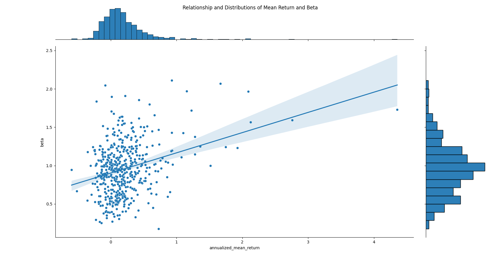
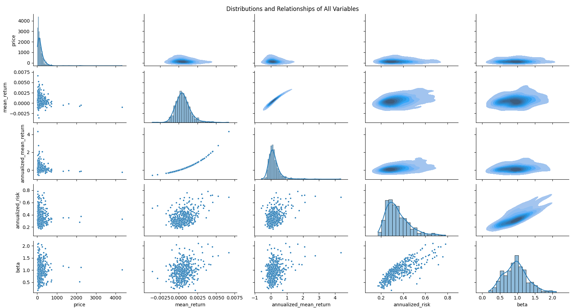

This visualization focuses on the relationship between the beta and the annualized mean return for the stocks, with their respective distributions graphed as well. This graph is a scatterplot with linear regression, with the highlighted areas representing a 95% confidence interval band. This graph not only provides a better insight on what the data looks like but also specifically supports our conclusion for hypothesis 1, that a higher beta is correlated with a higher annualized mean return. 

Certain aspects of this visualization could have been represented in a different way; the distribution of the data might have been able to be communicated effectively in a 2D histogram as well, but we thought that the linear regression served an important role in emphasizing the relationship that we noticed in our data which we then proved statistically.

One challenge that we faced not only with this specific visualization but with all our visualization attempts is an outlier data point, which was so far removed from the rest of the data that it made graphing the data nonsensical. This data point was for First Republic Bank (FRC) which had an annualized mean return value of 40, causing the data to lose all interpretability when graphed. We chose to remove the outlier when graphing the data but to mention it here to maintain accountability of our results.

While this graph could be represented alone without any text, we will add text in order to prevent any confusion about the results and to emphasize how this graph differs from our other visualization.

This visualization lists the relationships and the distributions of all the variables we collected for our data. The graph has two different representations of the same relationships for better understanding of the data: we included scatterplots for the bottom half and heatmaps for the top half. The diagonal is a series of histograms to show the distribution of the stock data.

One potential way we could have alternated the visualization is with linear regression plots instead of the scatterplots below; however, we chose not to because not all the scatter plots showed linear relationships, thus adding unnecessary and potentially misleading features to our visualization. 

We encountered difficulties choosing which kind of graphs to use to represent the data, since there weren’t distinct classes in the data, so there weren’t many ways we could think of giving a coherent view of the data and its relationships besides these three ways.

This set of graphs will require text due to how much information is being displayed. The text we will include on the poster will walk a reader through the distributions of the data as well as some of the key relationships to take note of which we analyzed.

Methodology for generating the above visualizations are contained in `visualization.py`.